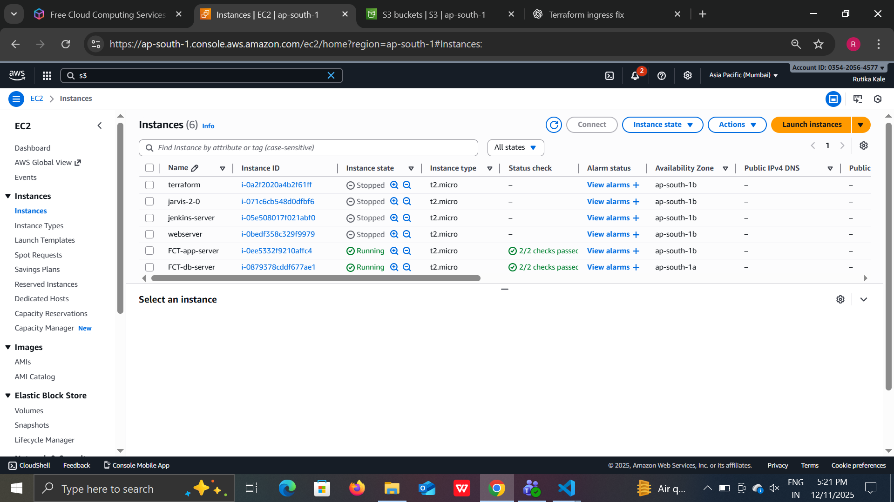
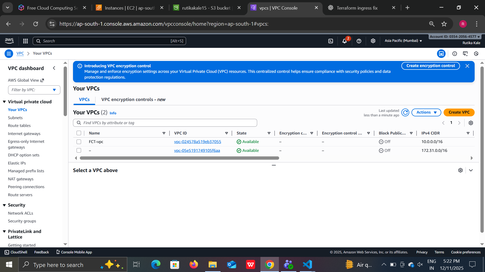
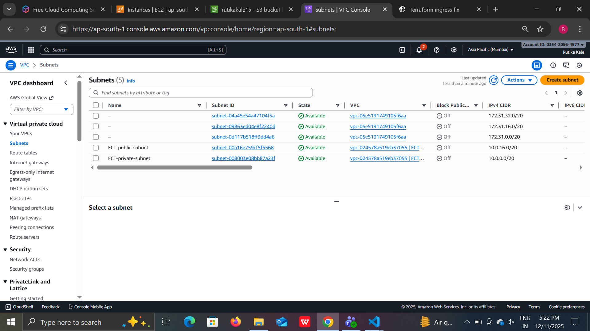

# 🚀 Two-Tier AWS Architecture using Terraform

A complete, production-grade Two-Tier AWS Infrastructure deployed using Terraform, following best DevOps & IaC practices.

Includes VPC, Subnets, Routing, Security Groups, EC2 Instances, Load Balancer (optional), and a full screenshots + diagram section.

## 📌 Architecture Diagram


---

## 📘 Project Overview

This Terraform project provisions:

* VPC (Virtual Private Cloud)

* Public & Private Subnets

* Internet Gateway

* NAT Gateway

* Route Tables

* Security Groups

* EC2 Instances (Frontend + Backend)

* Application Load Balancer (optional)

* Outputs & variable management

This repository is fully modular, reusable, and customizable for any production infrastructure.

## 🏗️ Folder Structure
```
 terraform-two-tier-project
 ┣  main.tf
 ┣  variables.tf
 ┣  outputs.tf
 ┣  provider.tf
 ┣  terraform.tfvars
 ┣  modules/
 ┃ ┣  vpc
 ┃ ┣  ec2
 ┃ ┗  security-groups
 ┗  screenshots/
```
## ⚙️ How to Deploy

**1️⃣ Initialize Terraform**
```
terraform init
```
**2️⃣ Validate configuration**
```
terraform validate
```
**3️⃣ Preview resources**
```
terraform plan
```
**4️⃣ Apply to create infrastructure**
```
terraform apply -auto-approve
```
**5️⃣ Destroy when needed**
```
terraform destroy
```
---
## 🖼️ Screenshots

### EC2 Instances


### VPC Overview


### Subnet Details


### Security Groups


### Route Tables


## 🔧 Key Features

* ✔️ Fully automated AWS provisioning

* ✔️ Clean modular Terraform structure

* ✔️ Reusable for any two-tier architecture

* ✔️ Beginner-friendly + production-ready

* ✔️ Supports scalability + ALB integration

## 📤 Terraform Outputs

* Once applied, Terraform provides:

* Public EC2 IP(s)

* Private EC2 IP(s)

* Load balancer DNS (if enabled)

* VPC ID

* Subnet IDs

## 📎 Important Notes

* Configure AWS CLI before running Terraform

* Never push credentials or secret keys

* Store sensitive data in `.tfvars`

* Add `.gitignore` to avoid accidental leaks

* Use separate workspace for dev/staging/prod

## 🧑‍💻 Author

Rutika Kale